# Architecture

GenQuery runs a four-stage pipeline by default. Each stage has a focused responsibility and can be customized or replaced.

## Pipeline overview

```mermaid pipeline-flow
flowchart LR
  A["User query"] --> B["1. Schema Inspector
 (SQLAlchemy)"]

  B -- "Full SchemaContext" --> C["2. Semantic Ranker
 (LLM)"]

  C -- "Ranked SchemaContext" --> D["3. Query Planner
 (LLM)"]

  D -- "QueryPlan" --> E["4. Query Executor
 (LLM + SQLAlchemy)"]

  E -- "Polars DataFrame / Stream" --> F["QueryResult"]

  style F fill: #2563eb22,stroke:#2563eb,stroke-width:2px
  style A fill: #0f172a22,stroke:#0f172a,stroke-width:1px
  style B fill: #1d4ed822,stroke:#1d4ed8,stroke-width:1px
  style C fill: #3b82f622,stroke:#3b82f6,stroke-width:1px
  style D fill: #60a5fa22,stroke:#60a5fa,stroke-width:1px
  style E fill: #93c5fd22,stroke:#93c5fd,stroke-width:1px
```



## Default stages

1. **Schema Inspector** — Connects to the database through SQLAlchemy, extracts schema metadata (tables, columns, indexes, foreign keys, comments), and caches it to disk. Uses a time‑based TTL and can refresh in the background.
2. **Semantic Ranker** — Calls an LLM to identify and return only the most relevant tables for the user's query, reducing prompt size and token cost for large schemas. Falls back to the first N tables if the LLM response cannot be parsed.
3. **Query Planner** — Breaks the natural‑language request into a structured execution plan. The plan uses a strategy (`single`, `sequential`, or `parallel`) and lists explicit steps that the executor must generate SQL for.
4. **Query Executor** — Generates SQL for each plan step, applies AST‑based security validation (read‑only enforcement, row limits, RLS injection), executes the queries safely, and returns a Polars DataFrame or a final‑result stream of Polars DataFrame batches.

Both synchronous and asynchronous pipeline implementations are available. The async pipeline uses `AsyncSchemaInspectorStage`, `AsyncSemanticRankerStage`, `AsyncQueryPlannerStage`, and `AsyncQueryExecutorStage`.

## Data flow

```text pipeline-flow.txt
User question
  -> Schema inspection
  -> Relevant table ranking
  -> Execution plan generation
  -> SQL generation and validation
  -> Database execution
  -> Polars DataFrame or stream
```

## Lifecycle detail

### Schema caching

Inspected schema is cached to `.gq_cache` with a configurable TTL. If the cache is approaching expiry, the inspector refreshes it in a background thread (sync) or a background asyncio task (async).

### LLM ranker fallback

When the LLM ranker cannot be parsed, the system falls back to the first `top_k` tables. This prevents one failed ranking from blocking query execution.

### Plan strategies

- `single` — One SQL statement.
- `sequential` — Multiple statements executed in order.
- `parallel` — Multiple statements that can be executed concurrently.

### Security layer

The executor runs an AST validator that rejects anything that is not a `SELECT` statement. It then modifies the AST to apply `row_limit` and Row‑Level Security conditions before generating the final SQL string.

## Related pages

- [Pipeline](./pipeline.md)
- [QueryResult](./query-result.md)
- [Custom Pipeline Stages](../customization/custom-pipeline-stages.md)
- [Security Overview](../security/overview.md)
